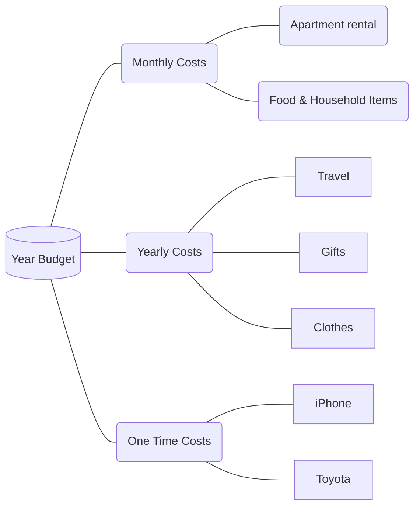

# easy-budget

```mermaid
graph LR;
    budget[(Year Budget)] --- month(Monthly Costs)
    budget --- year(Yearly Costs)
    budget --- one(One Time Costs)
    month --- apt(Apartment rental)
    month --- food(Food & Household Items)
    year --- Travel
    year --- Gifts
    year --- Clothes
    one --- iPhone
    one --- Toyota
```
